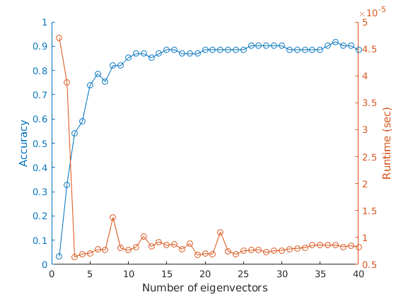
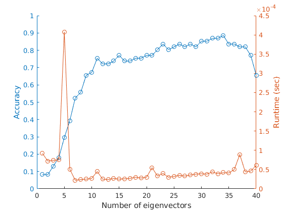

# Facial Recognition
Eigenface and Bayesian facial recognition algorithms using MATLAB (2018).
Created for the Quantitative Engineering Analysis course at [Olin College of Engineering](www.olin.edu), Spring 2018.

### [Paper](EigenfaceTechnicalPaper.pdf) Abstract
"Humans are remarkably skilled at identifying faces; we associate faces to our friends, family, supervisors, celebrities, and acquaintances with little to no effort. Developing a facial recognition program that is nearly as robust, accurate, and fast as a human presents many challenges. For example, superfluous variation in datasets of faces can easily confuse a computer. Our goal in this paper is to minimize needless variation while emphasizing data that is important for facial recognition. We do this by applying two facial recognition algorithms--the Euclidean-distance-driven Eigenfaces and the probabilistic Bayesian approach--to a data set of faces taken from our class. We break down the mathematical concepts of each algorithm, including Singular Value Decomposition, Principle Component Analysis, and Bayesian normal distribution. Our results showed that the Eigenface algorithm was more effective than the Bayesian algorithm, with the former being 90.16% accurate and running in 0.000001 seconds and the latter being 86.89% accurate and running in 0.00007 seconds. While further investigation is necessary, the results point towards Bayesian for real-world application."

### Results
##### Eigenface Approach

"The figure shows the accuracy and average runtime of using *k* number of eigenvectors to define the face space with. Diminishing returns on performance begins around 37 eigenvectors" -pg 10

##### Bayesian Approach

"The figure shows the accuracy and average runtime of using *k* number of eigenvectors to define the face space with. Diminishing returns on performance begins around 35 eigenvectors" -pg 12

### Credits
Authors: [Corey Cochran-Lepiz](https://github.com/coreyacl) and [Hwei-Shin Harriman](https://github.com/hsharriman).
